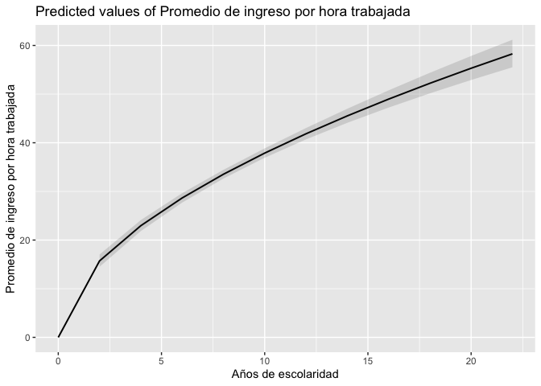

Regresión lineal múltiple
================
AE
10/06/2022

-   [Paquetes necesarios en la
    práctica](#paquetes-necesarios-en-la-práctica)
-   [Datos](#datos)
-   [Sub-setting para comparar
    modelos](#sub-setting-para-comparar-modelos)
-   [Regresión lineal](#regresión-lineal)
    -   [Repaso Regresión lineal
        simple](#repaso-regresión-lineal-simple)
    -   [Repaso de Diagnósticos](#repaso-de-diagnósticos)
-   [Regresión Lineal múltiple](#regresión-lineal-múltiple)
    -   [Agregando una variable
        categórica](#agregando-una-variable-categórica)
    -   [Otros supuestos](#otros-supuestos)
    -   [Tabla de modelos estimados](#tabla-de-modelos-estimados)
-   [Estandarizando que es gerundio](#estandarizando-que-es-gerundio)
-   [Post-estimación](#post-estimación)
    -   [Las predicciones](#las-predicciones)
    -   [Efectos marginales](#efectos-marginales)
-   [Extensiones del modelo de
    regresión](#extensiones-del-modelo-de-regresión)
    -   [Introducción a las
        interacciones](#introducción-a-las-interacciones)
    -   [Efectos no lineales](#efectos-no-lineales)
-   [No cumplo los supuestos](#no-cumplo-los-supuestos)
    -   [Heterocedasticidad](#heterocedasticidad)
    -   [Errores en clúster](#errores-en-clúster)
    -   [Jtools](#jtools)
-   [Regresión robusta](#regresión-robusta)
-   [Comparando modelos](#comparando-modelos)
-   [Extra:](#extra)
-   [Un poquito de reflexión](#un-poquito-de-reflexión)

# Paquetes necesarios en la práctica

Vamos a utilizad “pacman” para cargar los paquetes que utilizaremos en
esta sesión

``` r
#install.packages("sjPlot", dependencies=T) # solito porque da problmas
library(sjPlot)
```

    ## Learn more about sjPlot with 'browseVignettes("sjPlot")'.

``` r
if (!require("pacman")) install.packages("pacman") # instala pacman si se requiere
```

    ## Loading required package: pacman

``` r
pacman::p_load(tidyverse, # sobretodo para dplyr
              haven, #importación
              janitor, #tablas
              sjlabelled, # etiquetas
              DescTools, # Paquete para estimaciones y pruebas
              infer, # tidy way 
              broom,  # Una escobita para limpiar (pero es para arreglar)
              estimatr, car, stargazer, ggpubr, 
              jtools, lm.beta, robustbase, sandwich,
              officer,flextable,huxtable, ggstance, kableExtra) # Para la regresión
```

# Datos

Vamos a importar la base para Aguascalientes de la Encuesta Nacional de
Ocupación y Empleo, trimestre I de 2021.

> La Encuesta Nacional de Ocupación y Empleo (ENOE) es hoy día la
> encuesta continua levantada en hogares más grande que se aplica en el
> país. Su puesta en marcha en enero del 2005 marcó el fin de un modelo
> de captación y procesamiento que tuvo vigencia durante 20 años, el
> cual correspondió a la Encuesta Nacional de Empleo Urbano (ENEU)
> seguida por la Encuesta Nacional de Empleo (ENE) en donde aquélla
> quedó integrada. (INEGI, 2007)

Más acá: <https://www.inegi.org.mx/programas/enoe/15ymas/>

``` r
SDEMT122 <- read_dta("datos/SDEMT122.dta") 
```

\[Esta base sólo contiene el estado de Aguascalientes para que sea menos
pesada\]

# Sub-setting para comparar modelos

Vamos a hacer una sub-base de nuestras posibles variables explicativas.
Esto es importante porque sólo podemos comparar modelos con la misma
cantidad de observaciones.

``` r
mydata<- SDEMT122 %>% 
  filter(clase2==1) %>%  # me quedo con la población ocupada
  filter(ing_x_hrs>0) %>% # ingresos válidso
  filter(anios_esc<99) %>% # quito missings anios de escolaridad
  filter(eda>14 & eda<99) %>% #PET
  select(eda, sex, anios_esc, ing_x_hrs, pos_ocu, imssissste, medica5c, ent)  
  
tail(mydata)
```

    ## Warning in knit_print.huxtable(ht): Unrecognized output format "gfm-yaml". Using `to_screen` to print huxtables.
    ## Set options("huxtable.knitr_output_format") manually to "latex", "html", "rtf", "docx", "pptx", "md" or "screen".

      ┌──────────────────────────────────────────────────────────────────
      │ eda   sex   anios_es   ing_x_hr   pos_ocu   imssisss   medica5c  
      │                    c          s             te                   
      ├──────────────────────────────────────────────────────────────────
      │  52   1            9       25     1         1          3         
      │  68   1            6       26.8   3         4          1         
      │  26   1            9       23.4   1         4          4         
      │  50   1            6       34     1         1          3         
      │  17   1            9       25     1         4          1         
      │  40   1           12       87.2   1         1          3         
      └──────────────────────────────────────────────────────────────────

Column names: eda, sex, anios_esc, ing_x\_hrs, pos_ocu, imssissste,
medica5c, ent

7/8 columns shown.

``` r
mydata %>% 
  ggplot()+ 
  aes(anios_esc, log(ing_x_hrs)) +
        geom_jitter()
```

<!-- -->

``` r
mydata$log_ing_x_hrs<-log(mydata$ing_x_hrs)

cor(mydata$log_ing_x_hrs, mydata$anios_esc,  use = "pairwise")
```

    ## [1] 0.4269749

Una prueba de hipotésis sobe la correlación

``` r
cor_test<-mydata %>% 
  with(
    cor.test(log_ing_x_hrs, anios_esc, use="pairwise.complete.obs")
  )

#dos modos de visualizar el resultado
cor_test 
```

    ## 
    ##  Pearson's product-moment correlation
    ## 
    ## data:  log_ing_x_hrs and anios_esc
    ## t = 25.234, df = 2856, p-value < 2.2e-16
    ## alternative hypothesis: true correlation is not equal to 0
    ## 95 percent confidence interval:
    ##  0.3965175 0.4564934
    ## sample estimates:
    ##       cor 
    ## 0.4269749

``` r
tidy(cor_test)
```

    ## Warning in knit_print.huxtable(ht): Unrecognized output format "gfm-yaml". Using `to_screen` to print huxtables.
    ## Set options("huxtable.knitr_output_format") manually to "latex", "html", "rtf", "docx", "pptx", "md" or "screen".

┌─────────────────────────────────────────────────────────────────────────────
│ estimate statisti p.value paramete conf.low conf.hig method  
│ c r h  
├─────────────────────────────────────────────────────────────────────────────
│ 0.427 25.2 5.27e-12 2856 0.397 0.456 Pearson’  
│ 7 s  
│ product-  
│ moment  
│ correlat  
│ ion  
└─────────────────────────────────────────────────────────────────────────────

Column names: estimate, statistic, p.value, parameter, conf.low,
conf.high, method, alternative

7/8 columns shown.

# Regresión lineal

## Repaso Regresión lineal simple


Donde los parámetros

y

describen la pendiente y el intercepto de la población, respectivamente.

La regresión lineal nos ayuda a describir una relación a través de una
línea recta.

``` r
hist(log(mydata$ing_x_hrs))
```

<!-- -->

Una vez transformada nuestra variable, corremos el modelo

``` r
modelo <-lm(log_ing_x_hrs ~anios_esc, data=mydata, 
            na.action=na.exclude)

summary(modelo) # resultados
```

    ## 
    ## Call:
    ## lm(formula = log_ing_x_hrs ~ anios_esc, data = mydata, na.action = na.exclude)
    ## 
    ## Residuals:
    ##      Min       1Q   Median       3Q      Max 
    ## -2.58590 -0.29104 -0.01431  0.29881  2.26285 
    ## 
    ## Coefficients:
    ##             Estimate Std. Error t value Pr(>|t|)    
    ## (Intercept) 2.930106   0.028339  103.40   <2e-16 ***
    ## anios_esc   0.064423   0.002553   25.23   <2e-16 ***
    ## ---
    ## Signif. codes:  0 '***' 0.001 '**' 0.01 '*' 0.05 '.' 0.1 ' ' 1
    ## 
    ## Residual standard error: 0.5289 on 2856 degrees of freedom
    ## Multiple R-squared:  0.1823, Adjusted R-squared:  0.182 
    ## F-statistic: 636.8 on 1 and 2856 DF,  p-value: < 2.2e-16

Con “tidy()”

``` r
tidy(modelo) # Pruebas de hipótesis de los coeficientes
```

    ## Warning in knit_print.huxtable(ht): Unrecognized output format "gfm-yaml". Using `to_screen` to print huxtables.
    ## Set options("huxtable.knitr_output_format") manually to "latex", "html", "rtf", "docx", "pptx", "md" or "screen".

         ┌────────────────────────────────────────────────────────────┐
         │ term          estimate   std.error   statistic     p.value │
         ├────────────────────────────────────────────────────────────┤
         │ (Intercept)     2.93       0.0283        103     0         │
         │ anios_esc       0.0644     0.00255        25.2   5.27e-127 │
         └────────────────────────────────────────────────────────────┘

Column names: term, estimate, std.error, statistic, p.value

Para obtener los intervalos de confianza, podemos hacerlo a partir del
siguiente comando:

``` r
confint(modelo)
```

    ##                 2.5 %     97.5 %
    ## (Intercept) 2.8745400 2.98567230
    ## anios_esc   0.0594173 0.06942925

Para el ajuste global del modelo, podemos utilzar el comando “glance()”
sobre el objeto de nuestro modelo, ello nos dará la información
correspondiente:

``` r
glance(modelo) # resultado ajuste global
```

    ## Warning in knit_print.huxtable(ht): Unrecognized output format "gfm-yaml". Using `to_screen` to print huxtables.
    ## Set options("huxtable.knitr_output_format") manually to "latex", "html", "rtf", "docx", "pptx", "md" or "screen".

     ┌────────────────────────────────────────────────────────────────────
     │ r.square   adj.r.sq   sigma   statisti    p.value   df     logLik  
     │        d      uared                  c                             
     ├────────────────────────────────────────────────────────────────────
     │    0.182      0.182   0.529        637   5.27e-12    1   -2.23e+0  
     │                                                 7               3  
     └────────────────────────────────────────────────────────────────────

Column names: r.squared, adj.r.squared, sigma, statistic, p.value, df,
logLik, AIC, BIC, deviance, df.residual, nobs

7/12 columns shown. Otra manera de ver este ajuste es con el comando
“anova()”:

``` r
anova(modelo)
```

    ## Warning in knit_print.huxtable(ht): Unrecognized output format "gfm-yaml". Using `to_screen` to print huxtables.
    ## Set options("huxtable.knitr_output_format") manually to "latex", "html", "rtf", "docx", "pptx", "md" or "screen".

               ┌───────────────────────────────────────────────┐
               │   Df   Sum Sq   Mean Sq   F value      Pr(>F) │
               ├───────────────────────────────────────────────┤
               │    1      178    178          637   5.27e-127 │
               │ 2856      799      0.28                       │
               └───────────────────────────────────────────────┘

Column names: Df, Sum Sq, Mean Sq, F value, Pr(\>F)

## Repaso de Diagnósticos

``` r
plot(modelo)
```

<!-- --><!-- --><!-- --><!-- -->

\##1. Outliers y Normalidad

``` r
# Assessing Outliers
outlierTest(modelo) # Bonferonni p-value for most extreme obs
```

    ##       rstudent unadjusted p-value Bonferroni p
    ## 280  -4.910303         9.6055e-07    0.0027452
    ## 1250 -4.750768         2.1266e-06    0.0060779
    ## 643  -4.477714         7.8406e-06    0.0224080
    ## 1334 -4.463367         8.3807e-06    0.0239520

``` r
out<-outlierTest(modelo) # guardamos en objeto
```

``` r
qqPlot<-qqPlot(modelo)
```

<!-- -->

``` r
ggpubr::ggqqplot(mydata$log_ing_x_hrs)
```

<!-- -->

``` r
car::qqPlot(modelo, main="QQ Plot") #qq plot for studentized resid
```

<!-- -->

    ## [1]  280 1250

\##2. Homocedasticidad

``` r
# non-constant error variance test
ncvTest(modelo)
```

    ## Non-constant Variance Score Test 
    ## Variance formula: ~ fitted.values 
    ## Chisquare = 31.43588, Df = 1, p = 2.0614e-08

``` r
# plot studentized residuals vs. fitted values 
spreadLevelPlot(modelo)
```

<!-- -->

    ## 
    ## Suggested power transformation:  -0.4467247

¿Qué hacemos con los outliers?

Volvemos a correr nuestro modelo, hoy con una base que nos quite estas
observaciones.

Como es nuestro modelo original, le pondremos cero

``` r
names(out$bonf.p)
```

    ## [1] "280"  "1250" "643"  "1334"

``` r
outliers<-rbind(as.integer(names(out$bonf.p)), qqPlot) # lista los casos 
```

Vamos a eliminar estos casos que son extremos (¡Ojo! esto tiene
implicaciones de interpretación y debe ser justificado metodológicamente
y ser señalado como una limitante)

Tenemos el nombre de las filas que nos dan problemas

``` r
mydata$rownames<-rownames(mydata)
#View(mydata) # verificamos que no hayamos movido el orden

mydata2<-mydata[-outliers,]
```

Corremos un nuevo modelo

``` r
modelo0<-lm(log_ing_x_hrs ~anios_esc, data=mydata2, na.action=na.exclude)
summary(modelo0)
```

    ## 
    ## Call:
    ## lm(formula = log_ing_x_hrs ~ anios_esc, data = mydata2, na.action = na.exclude)
    ## 
    ## Residuals:
    ##      Min       1Q   Median       3Q      Max 
    ## -2.20694 -0.29375 -0.01646  0.29587  2.26477 
    ## 
    ## Coefficients:
    ##             Estimate Std. Error t value Pr(>|t|)    
    ## (Intercept) 2.928188   0.027936   104.8   <2e-16 ***
    ## anios_esc   0.064938   0.002517    25.8   <2e-16 ***
    ## ---
    ## Signif. codes:  0 '***' 0.001 '**' 0.01 '*' 0.05 '.' 0.1 ' ' 1
    ## 
    ## Residual standard error: 0.5212 on 2852 degrees of freedom
    ## Multiple R-squared:  0.1892, Adjusted R-squared:  0.1889 
    ## F-statistic: 665.4 on 1 and 2852 DF,  p-value: < 2.2e-16

¿Cuando parar?

``` r
qqPlot(modelo0)
```

<!-- -->

    ## [1] 1425 1585

``` r
outlierTest(modelo0)
```

    ##      rstudent unadjusted p-value Bonferroni p
    ## 1425 4.365405          1.314e-05     0.037503

¡Este puede ser un proceso infinito! Si quitamos lo anormal, esto mueve
nuestros rangos y al quitar un outlier, otra variable que antes no era
outlier en el ajuste se puede convertir en outlier.

# Regresión Lineal múltiple

## Agregando una variable categórica

Sexo divide a nuestra población en dos grupos

``` r
mydata %>% 
  ggplot()+ 
  aes(anios_esc,
      log(ing_x_hrs),
      color=as_label(sex)) +
  geom_jitter() +
  geom_smooth(method="lm")+
  facet_wrap(vars(as_label(sex)))
```

    ## `geom_smooth()` using formula 'y ~ x'

<!-- -->

Cuando nosotros tenemos una variable categórica para la condición de
sexo.


``` r
modelo1<-lm(log_ing_x_hrs ~anios_esc + as_label(sex), data=mydata, na.action=na.exclude)
summary(modelo1)
```

    ## 
    ## Call:
    ## lm(formula = log_ing_x_hrs ~ anios_esc + as_label(sex), data = mydata, 
    ##     na.action = na.exclude)
    ## 
    ## Residuals:
    ##      Min       1Q   Median       3Q      Max 
    ## -2.54905 -0.30816 -0.02475  0.29403  2.30629 
    ## 
    ## Coefficients:
    ##                     Estimate Std. Error t value Pr(>|t|)    
    ## (Intercept)         2.944912   0.028775 102.344  < 2e-16 ***
    ## anios_esc           0.065155   0.002563  25.424  < 2e-16 ***
    ## as_label(sex)Mujer -0.058246   0.020408  -2.854  0.00435 ** 
    ## ---
    ## Signif. codes:  0 '***' 0.001 '**' 0.01 '*' 0.05 '.' 0.1 ' ' 1
    ## 
    ## Residual standard error: 0.5282 on 2855 degrees of freedom
    ## Multiple R-squared:  0.1846, Adjusted R-squared:  0.1841 
    ## F-statistic: 323.2 on 2 and 2855 DF,  p-value: < 2.2e-16

Este modelo tiene coeficientes que deben leerse “condicionados”. Es
decir, en este caso tenemos que el coeficiente asociado a la edad,
mantiene constante el valor de sexo y viceversa.

¿Cómo saber is ha mejorado nuestro modelo? Podemos comparar el ajuste
con la anova, es decir, una prueba F

``` r
pruebaf0<-anova(modelo, modelo1)
pruebaf0
```

    ## Warning in knit_print.huxtable(ht): Unrecognized output format "gfm-yaml". Using `to_screen` to print huxtables.
    ## Set options("huxtable.knitr_output_format") manually to "latex", "html", "rtf", "docx", "pptx", "md" or "screen".

             ┌───────────────────────────────────────────────────┐
             │   Res.Df   RSS    Df   Sum of Sq      F    Pr(>F) │
             ├───────────────────────────────────────────────────┤
             │ 2.86e+03   799                                    │
             │ 2.86e+03   797     1        2.27   8.15   0.00435 │
             └───────────────────────────────────────────────────┘

Column names: Res.Df, RSS, Df, Sum of Sq, F, Pr(\>F)

Como puedes ver, el resultado muestra “DF” (grados de libertad en
español) de 1 (lo que indica que el modelo más complejo tiene un
parámetro adicional) y un valor p muy pequeño (\<.001). Esto significa
que agregar el sexo al modelo lleva a un ajuste significativamente mejor
sobre el modelo original.

Podemos seguir añadiendo variables sólo “sumando” en la función


``` r
modelo2<-lm(log_ing_x_hrs ~ anios_esc + as_label(sex) + eda, 
            data=mydata, 
            na.action=na.exclude)
summary(modelo2)
```

    ## 
    ## Call:
    ## lm(formula = log_ing_x_hrs ~ anios_esc + as_label(sex) + eda, 
    ##     data = mydata, na.action = na.exclude)
    ## 
    ## Residuals:
    ##      Min       1Q   Median       3Q      Max 
    ## -2.63819 -0.28954 -0.00834  0.29308  2.25535 
    ## 
    ## Coefficients:
    ##                      Estimate Std. Error t value Pr(>|t|)    
    ## (Intercept)         2.5997575  0.0447779  58.059  < 2e-16 ***
    ## anios_esc           0.0718597  0.0026085  27.548  < 2e-16 ***
    ## as_label(sex)Mujer -0.0680613  0.0200914  -3.388 0.000715 ***
    ## eda                 0.0073802  0.0007421   9.945  < 2e-16 ***
    ## ---
    ## Signif. codes:  0 '***' 0.001 '**' 0.01 '*' 0.05 '.' 0.1 ' ' 1
    ## 
    ## Residual standard error: 0.5194 on 2854 degrees of freedom
    ## Multiple R-squared:  0.2119, Adjusted R-squared:  0.2111 
    ## F-statistic: 255.9 on 3 and 2854 DF,  p-value: < 2.2e-16

Y podemos ver si introducir esta variable afectó al ajuste global del
modelo

``` r
pruebaf1<-anova(modelo1, modelo2)
pruebaf1
```

    ## Warning in knit_print.huxtable(ht): Unrecognized output format "gfm-yaml". Using `to_screen` to print huxtables.
    ## Set options("huxtable.knitr_output_format") manually to "latex", "html", "rtf", "docx", "pptx", "md" or "screen".

             ┌────────────────────────────────────────────────────┐
             │   Res.Df   RSS    Df   Sum of Sq      F     Pr(>F) │
             ├────────────────────────────────────────────────────┤
             │ 2.86e+03   797                                     │
             │ 2.85e+03   770     1        26.7   98.9   6.23e-23 │
             └────────────────────────────────────────────────────┘

Column names: Res.Df, RSS, Df, Sum of Sq, F, Pr(\>F)

Hoy que tenemos más variables podemos hablar de revisar dos supuestos
más.

## Otros supuestos

Además de los supuestos de la regresión simple, podemos revisar estos
otros. De nuevo, usaremos el paquete {car}

1.  Linealidad en los parámetros (será más díficil entre más variables
    tengamos)

2.  La normalidad también, porque debe ser multivariada

3.  Multicolinealidad La prueba más común es la de Factor Influyente de
    la Varianza (VIF) por sus siglas en inglés. La lógica es que la
    multicolinealidad tendrá efectos en nuestro R2, inflándolo. De ahí
    que observamos de qué variable(s) proviene este problema relacionado
    con la multicolinealidad.

Si el valor es mayor a 5, tenemos un problema muy grave.

``` r
vif(modelo2)
```

    ##     anios_esc as_label(sex)           eda 
    ##      1.082416      1.012556      1.072086

## Tabla de modelos estimados

Para los muy avanzados, con el paquete “stargazer” se pueden pasar a
LaTeX fácilmente.

``` r
#stargazer(modelo0, modelo1,modelo2, type = 'latex', header=FALSE)
```

``` r
stargazer(modelo, modelo1,modelo2, type = 'text', header=FALSE)
```

    ## 
    ## =================================================================================================
    ##                                                  Dependent variable:                             
    ##                     -----------------------------------------------------------------------------
    ##                                                     log_ing_x_hrs                                
    ##                                (1)                       (2)                       (3)           
    ## -------------------------------------------------------------------------------------------------
    ## anios_esc                   0.064***                  0.065***                  0.072***         
    ##                              (0.003)                   (0.003)                   (0.003)         
    ##                                                                                                  
    ## as_label(sex)Mujer                                    -0.058***                 -0.068***        
    ##                                                        (0.020)                   (0.020)         
    ##                                                                                                  
    ## eda                                                                             0.007***         
    ##                                                                                  (0.001)         
    ##                                                                                                  
    ## Constant                    2.930***                  2.945***                  2.600***         
    ##                              (0.028)                   (0.029)                   (0.045)         
    ##                                                                                                  
    ## -------------------------------------------------------------------------------------------------
    ## Observations                  2,858                     2,858                     2,858          
    ## R2                            0.182                     0.185                     0.212          
    ## Adjusted R2                   0.182                     0.184                     0.211          
    ## Residual Std. Error     0.529 (df = 2856)         0.528 (df = 2855)         0.519 (df = 2854)    
    ## F Statistic         636.756*** (df = 1; 2856) 323.247*** (df = 2; 2855) 255.856*** (df = 3; 2854)
    ## =================================================================================================
    ## Note:                                                                 *p<0.1; **p<0.05; ***p<0.01

También la librería “sjPlot” tiene el comando “plot_model()” (instala el
comando si no lo tienes)

``` r
library(sjPlot)
plot_model(modelo1)
```

<!-- -->

``` r
plot_models(modelo, modelo1, modelo2)
```

<!-- -->

``` r
tidy(modelo2)%>%
  kbl() %>%
  kable_paper("hover", full_width = F)
```

<table class=" lightable-paper lightable-hover" style="font-family: &quot;Arial Narrow&quot;, arial, helvetica, sans-serif; width: auto !important; margin-left: auto; margin-right: auto;">
<thead>
<tr>
<th style="text-align:left;">
term
</th>
<th style="text-align:right;">
estimate
</th>
<th style="text-align:right;">
std.error
</th>
<th style="text-align:right;">
statistic
</th>
<th style="text-align:right;">
p.value
</th>
</tr>
</thead>
<tbody>
<tr>
<td style="text-align:left;">
(Intercept)
</td>
<td style="text-align:right;">
2.5997575
</td>
<td style="text-align:right;">
0.0447779
</td>
<td style="text-align:right;">
58.058900
</td>
<td style="text-align:right;">
0.0000000
</td>
</tr>
<tr>
<td style="text-align:left;">
anios_esc
</td>
<td style="text-align:right;">
0.0718597
</td>
<td style="text-align:right;">
0.0026085
</td>
<td style="text-align:right;">
27.548395
</td>
<td style="text-align:right;">
0.0000000
</td>
</tr>
<tr>
<td style="text-align:left;">
as_label(sex)Mujer
</td>
<td style="text-align:right;">
-0.0680613
</td>
<td style="text-align:right;">
0.0200914
</td>
<td style="text-align:right;">
-3.387578
</td>
<td style="text-align:right;">
0.0007147
</td>
</tr>
<tr>
<td style="text-align:left;">
eda
</td>
<td style="text-align:right;">
0.0073802
</td>
<td style="text-align:right;">
0.0007421
</td>
<td style="text-align:right;">
9.944986
</td>
<td style="text-align:right;">
0.0000000
</td>
</tr>
</tbody>
</table>

# Estandarizando que es gerundio

Comparar los resultados de los coeficientes es díficil, porque el efecto
está medido en las unidades que fueron medidas. Por lo que no sería tan
comparable el efecto que tenemos de nuestro índice sumativo (proporción
de lugares con inseguridad declarada) con respecto a la eda (que se mide
en años). Por lo que a veces es mejor usar las medida estandarizadas (es
decir, nuestra puntajes z).

Podemos hacerlo transormando nuestras variables de origen e
introducirlas al modelo. O bien, podemos usar un paquete que lo hace
directamente. Los coeficientes calculados se les conoce como “beta”

Simplemente aplicamos el comando a nuestros modelos ya calculados

``` r
lm.beta(modelo2)
```

    ## 
    ## Call:
    ## lm(formula = log_ing_x_hrs ~ anios_esc + as_label(sex) + eda, 
    ##     data = mydata, na.action = na.exclude)
    ## 
    ## Standardized Coefficients::
    ##        (Intercept)          anios_esc as_label(sex)Mujer                eda 
    ##                 NA         0.47626112        -0.05664357         0.17110821

Hoy la comparación será mucho más clara y podemos ver qué variable tiene
mayor efecto en nuestra dependiente.

``` r
modelo_beta<-lm.beta(modelo2)
modelo_beta
```

    ## 
    ## Call:
    ## lm(formula = log_ing_x_hrs ~ anios_esc + as_label(sex) + eda, 
    ##     data = mydata, na.action = na.exclude)
    ## 
    ## Standardized Coefficients::
    ##        (Intercept)          anios_esc as_label(sex)Mujer                eda 
    ##                 NA         0.47626112        -0.05664357         0.17110821

Para graficarlos, podemos usar de nuevo el comando plot_model(), con una
opción

``` r
plot_model(modelo2, type="std")
```

<!-- -->

¿Qué podemos concluir de estos resultados?

# Post-estimación

## Las predicciones

Para ello a veces es mejor transformar nuestras variables estiquetadas.
Reescribimos nuestro modelo

``` r
mydata<-mydata %>% 
  mutate(sex=as_label(sex))

modelo2<-lm(log_ing_x_hrs ~ anios_esc +sex + eda, data=mydata)

summary(modelo2)
```

    ## 
    ## Call:
    ## lm(formula = log_ing_x_hrs ~ anios_esc + sex + eda, data = mydata)
    ## 
    ## Residuals:
    ##      Min       1Q   Median       3Q      Max 
    ## -2.63819 -0.28954 -0.00834  0.29308  2.25535 
    ## 
    ## Coefficients:
    ##               Estimate Std. Error t value Pr(>|t|)    
    ## (Intercept)  2.5997575  0.0447779  58.059  < 2e-16 ***
    ## anios_esc    0.0718597  0.0026085  27.548  < 2e-16 ***
    ## sexMujer    -0.0680613  0.0200914  -3.388 0.000715 ***
    ## eda          0.0073802  0.0007421   9.945  < 2e-16 ***
    ## ---
    ## Signif. codes:  0 '***' 0.001 '**' 0.01 '*' 0.05 '.' 0.1 ' ' 1
    ## 
    ## Residual standard error: 0.5194 on 2854 degrees of freedom
    ## Multiple R-squared:  0.2119, Adjusted R-squared:  0.2111 
    ## F-statistic: 255.9 on 3 and 2854 DF,  p-value: < 2.2e-16

Unos de los usos más comunes de los modelos estadísticos es la
predicción

``` r
sjPlot::plot_model(modelo2, type="pred", terms = "anios_esc")
```

<!-- -->

También podemos incluir la predecciones para los distintos valores de
las variables

``` r
plot_model(modelo2, type="pred", terms = c("anios_esc","sex")) + theme_blank()
```

<!-- -->

El orden de los términos importa:

``` r
plot_model(modelo2, type="pred", terms = c("sex","anios_esc")) + theme_blank()
```

<!-- -->

## Efectos marginales

Con los efectos marginales, por otro lado medimos el efecto promedio,
dejando el resto de variables constantes.

``` r
plot_model(modelo2, type="eff", terms = "anios_esc")
```

    ## Package `effects` is not available, but needed for `ggeffect()`. Either install package `effects`, or use `ggpredict()`. Calling `ggpredict()` now.FALSE

<!-- -->

``` r
plot_model(modelo2, type="eff", terms = "sex")
```

    ## Package `effects` is not available, but needed for `ggeffect()`. Either install package `effects`, or use `ggpredict()`. Calling `ggpredict()` now.FALSE

<!-- --> ¿Es el
mismo gráfico que con “pred”? Veamos la ayuda

¿Y si queremos ver esta informaicón graficada?

``` r
eff<-plot_model(modelo2, type="eff", terms = "anios_esc")
```

    ## Package `effects` is not available, but needed for `ggeffect()`. Either install package `effects`, or use `ggpredict()`. Calling `ggpredict()` now.FALSE

``` r
eff$data
```

    ## Warning in knit_print.huxtable(ht): Unrecognized output format "gfm-yaml". Using `to_screen` to print huxtables.
    ## Set options("huxtable.knitr_output_format") manually to "latex", "html", "rtf", "docx", "pptx", "md" or "screen".

     ┌───────────────────────────────────────────────────────────────────┐
     │  x   predicte   std.erro   conf.low   conf.hig   group   group_co │
     │             d          r                     h           l        │
     ├───────────────────────────────────────────────────────────────────┤
     │  0       2.88     0.0291       2.82       2.94   1       1        │
     │  2       3.02     0.0244       2.97       3.07   1       1        │
     │  4       3.17     0.0201       3.13       3.21   1       1        │
     │  6       3.31     0.0163       3.28       3.34   1       1        │
     │  8       3.45     0.0135       3.43       3.48   1       1        │
     │ 10       3.6      0.0124       3.57       3.62   1       1        │
     │ 12       3.74     0.0134       3.72       3.77   1       1        │
     │ 14       3.88     0.0161       3.85       3.92   1       1        │
     │ 16       4.03     0.0198       3.99       4.07   1       1        │
     │ 18       4.17     0.0241       4.13       4.22   1       1        │
     │ 20       4.32     0.0287       4.26       4.37   1       1        │
     │ 22       4.46     0.0335       4.39       4.53   1       1        │
     └───────────────────────────────────────────────────────────────────┘

Column names: x, predicted, std.error, conf.low, conf.high, group,
group_col

``` r
eff<-plot_model(modelo2, type="pred", terms = "anios_esc")
eff$data
```

    ## Warning in knit_print.huxtable(ht): Unrecognized output format "gfm-yaml". Using `to_screen` to print huxtables.
    ## Set options("huxtable.knitr_output_format") manually to "latex", "html", "rtf", "docx", "pptx", "md" or "screen".

     ┌───────────────────────────────────────────────────────────────────┐
     │  x   predicte   std.erro   conf.low   conf.hig   group   group_co │
     │             d          r                     h           l        │
     ├───────────────────────────────────────────────────────────────────┤
     │  0       2.88     0.0291       2.82       2.94   1       1        │
     │  2       3.02     0.0244       2.97       3.07   1       1        │
     │  4       3.17     0.0201       3.13       3.21   1       1        │
     │  6       3.31     0.0163       3.28       3.34   1       1        │
     │  8       3.45     0.0135       3.43       3.48   1       1        │
     │ 10       3.6      0.0124       3.57       3.62   1       1        │
     │ 12       3.74     0.0134       3.72       3.77   1       1        │
     │ 14       3.88     0.0161       3.85       3.92   1       1        │
     │ 16       4.03     0.0198       3.99       4.07   1       1        │
     │ 18       4.17     0.0241       4.13       4.22   1       1        │
     │ 20       4.32     0.0287       4.26       4.37   1       1        │
     │ 22       4.46     0.0335       4.39       4.53   1       1        │
     └───────────────────────────────────────────────────────────────────┘

Column names: x, predicted, std.error, conf.low, conf.high, group,
group_col

# Extensiones del modelo de regresión

## Introducción a las interacciones

Muchas veces las variables explicativas van a tener relación entre sí.
Por ejemplo ¿Las horas tendrá que ver con el sexo y afectan no sólo en
intercepto si no también la pendiente? Para ello podemos introducir una
interacción

``` r
modelo_int1<-lm(log_ing_x_hrs ~ anios_esc * sex , data = mydata, na.action=na.exclude)
summary(modelo_int1)
```

    ## 
    ## Call:
    ## lm(formula = log_ing_x_hrs ~ anios_esc * sex, data = mydata, 
    ##     na.action = na.exclude)
    ## 
    ## Residuals:
    ##      Min       1Q   Median       3Q      Max 
    ## -2.53753 -0.30752 -0.02321  0.29351  2.37263 
    ## 
    ## Coefficients:
    ##                     Estimate Std. Error t value Pr(>|t|)    
    ## (Intercept)         2.985700   0.035648  83.756  < 2e-16 ***
    ## anios_esc           0.061115   0.003304  18.500  < 2e-16 ***
    ## sexMujer           -0.165372   0.058956  -2.805  0.00507 ** 
    ## anios_esc:sexMujer  0.010131   0.005231   1.937  0.05289 .  
    ## ---
    ## Signif. codes:  0 '***' 0.001 '**' 0.01 '*' 0.05 '.' 0.1 ' ' 1
    ## 
    ## Residual standard error: 0.5279 on 2854 degrees of freedom
    ## Multiple R-squared:  0.1857, Adjusted R-squared:  0.1848 
    ## F-statistic:   217 on 3 and 2854 DF,  p-value: < 2.2e-16

Esta interacción lo que asume es que las pendientes pueden moverse
(aunque en este caso específico no lo hacen tanto porque no nos salió
significativa)

``` r
plot_model(modelo_int1, type="int", terms = c("sex", "anios_esc"))
```

<!-- -->

## Efectos no lineales

### Explicitando el logaritmo

``` r
mydata2<-mydata %>% filter(anios_esc>0)
modelo_log<-lm(log(ing_x_hrs) ~ log(anios_esc) + sex,
               data=mydata2, 
               na.action = na.exclude)

summary(modelo_log)
```

    ## 
    ## Call:
    ## lm(formula = log(ing_x_hrs) ~ log(anios_esc) + sex, data = mydata2, 
    ##     na.action = na.exclude)
    ## 
    ## Residuals:
    ##      Min       1Q   Median       3Q      Max 
    ## -2.60175 -0.31854 -0.03086  0.32011  2.36739 
    ## 
    ## Coefficients:
    ##                Estimate Std. Error t value Pr(>|t|)    
    ## (Intercept)     2.37591    0.05788  41.052   <2e-16 ***
    ## log(anios_esc)  0.54649    0.02508  21.790   <2e-16 ***
    ## sexMujer       -0.05091    0.02102  -2.423   0.0155 *  
    ## ---
    ## Signif. codes:  0 '***' 0.001 '**' 0.01 '*' 0.05 '.' 0.1 ' ' 1
    ## 
    ## Residual standard error: 0.5408 on 2821 degrees of freedom
    ## Multiple R-squared:  0.1441, Adjusted R-squared:  0.1435 
    ## F-statistic: 237.4 on 2 and 2821 DF,  p-value: < 2.2e-16

``` r
plot_model(modelo_log, type="pred", terms ="anios_esc")
```

    ## Model has log-transformed response. Back-transforming predictions to original response scale. Standard errors are still on the log-scale.

<!-- -->

### Efecto cuadrático (ojo con la sintaxis)

``` r
modelo_quadr<-lm(log_ing_x_hrs ~ anios_esc + I(anios_esc^2) + sex, 
                 data=mydata, 
                 na.action=na.exclude)
summary(modelo_quadr)
```

    ## 
    ## Call:
    ## lm(formula = log_ing_x_hrs ~ anios_esc + I(anios_esc^2) + sex, 
    ##     data = mydata, na.action = na.exclude)
    ## 
    ## Residuals:
    ##      Min       1Q   Median       3Q      Max 
    ## -2.48184 -0.26835 -0.01039  0.28270  2.29793 
    ## 
    ## Coefficients:
    ##                  Estimate Std. Error t value Pr(>|t|)    
    ## (Intercept)     3.4474508  0.0543800  63.396  < 2e-16 ***
    ## anios_esc      -0.0442604  0.0104295  -4.244 2.27e-05 ***
    ## I(anios_esc^2)  0.0051703  0.0004783  10.809  < 2e-16 ***
    ## sexMujer       -0.0620449  0.0200096  -3.101  0.00195 ** 
    ## ---
    ## Signif. codes:  0 '***' 0.001 '**' 0.01 '*' 0.05 '.' 0.1 ' ' 1
    ## 
    ## Residual standard error: 0.5178 on 2854 degrees of freedom
    ## Multiple R-squared:  0.2167, Adjusted R-squared:  0.2159 
    ## F-statistic: 263.2 on 3 and 2854 DF,  p-value: < 2.2e-16

Quizás con un gráfico de lo predicho tenemos más claro lo que hace ese
término

``` r
plot_model(modelo_quadr, type="pred", terms = c("anios_esc"))
```

<!-- -->

En efecto, lo que nos da el signo del cuadrático puede hablarnos del
comportamiento cóncavo hacia arriba o hacia abajo. La edad muchas veces
tiene este comportamiento en algunos fenómenos.

# No cumplo los supuestos

## Heterocedasticidad

El problema de la heterocedasticidad es que los errores estándar de
subestiman, por lo que si estos están en el cociente de nuestro
estadístico de prueba t, esto implicaría que nuestras pruebas podrían
estar arrojando valores significativos cuando no lo son.

Una forma muy sencilla es pedir los errores robustos, esto se puede
desarrollar con el paquete “estimatr”
<https://declaredesign.org/r/estimatr/articles/getting-started.html>

``` r
modelo2rob1 <- lm_robust(log_ing_x_hrs ~ anios_esc + as_label(sex) + eda, data = mydata)
summary(modelo2rob1)
```

    ## 
    ## Call:
    ## lm_robust(formula = log_ing_x_hrs ~ anios_esc + as_label(sex) + 
    ##     eda, data = mydata)
    ## 
    ## Standard error type:  HC2 
    ## 
    ## Coefficients:
    ##                    Estimate Std. Error t value   Pr(>|t|)  CI Lower  CI Upper
    ## (Intercept)         2.59976  0.0482176  53.917  0.000e+00  2.505213  2.694302
    ## anios_esc           0.07186  0.0030007  23.947 1.216e-115  0.065976  0.077744
    ## as_label(sex)Mujer -0.06806  0.0205704  -3.309  9.489e-04 -0.108396 -0.027727
    ## eda                 0.00738  0.0008104   9.107  1.549e-19  0.005791  0.008969
    ##                      DF
    ## (Intercept)        2854
    ## anios_esc          2854
    ## as_label(sex)Mujer 2854
    ## eda                2854
    ## 
    ## Multiple R-squared:  0.2119 ,    Adjusted R-squared:  0.2111 
    ## F-statistic: 192.1 on 3 and 2854 DF,  p-value: < 2.2e-16

``` r
tidy(modelo2rob1)
```

    ## Warning in knit_print.huxtable(ht): Unrecognized output format "gfm-yaml". Using `to_screen` to print huxtables.
    ## Set options("huxtable.knitr_output_format") manually to "latex", "html", "rtf", "docx", "pptx", "md" or "screen".

┌─────────────────────────────────────────────────────────────────────────────
│ term estimate std.erro statisti p.value conf.low conf.hig  
│ r c h  
├─────────────────────────────────────────────────────────────────────────────
│ (Interce 2.6     0.0482  53.9  0        2.51    2.69     
│ pt)    
│ anios_es 0.0719  0.003   23.9  1.22e-11 0.066   0.0777   
│ c 5  
│ as_label -0.0681  0.0206  -3.31 0.000949 -0.108   -0.0277   
│ (sex)Muj    
│ er  
│ eda 0.00738 0.00081 9.11 1.55e-19 0.00579 0.00897  
│    
└─────────────────────────────────────────────────────────────────────────────

Column names: term, estimate, std.error, statistic, p.value, conf.low,
conf.high, df, outcome

7/9 columns shown.

## Errores en clúster

Cuando tenemos individuos que pertenecen a una misma unidad, podemos
crear errores anidados en clúster:

``` r
# cluster robust standard errors
modelo2rob2<- lm_robust(log_ing_x_hrs ~ anios_esc + as_label(sex) + eda, data = mydata, clusters = ent)
```

    ## Warning in !(class(ret[["cluster"]]) %in% c("factor", "integer")) && !
    ## is.null(ret[["cluster"]]): 'length(x) = 3 > 1' in coercion to 'logical(1)'

``` r
# standard summary view also available
summary(modelo2rob2)
```

    ## 
    ## Call:
    ## lm_robust(formula = log_ing_x_hrs ~ anios_esc + as_label(sex) + 
    ##     eda, data = mydata, clusters = ent)
    ## 
    ## Standard error type:  CR2 
    ## 
    ## Coefficients:
    ##                    Estimate Std. Error    t value  Pr(>|t|) CI Lower CI Upper
    ## (Intercept)         2.59976  1.046e-16  2.484e+16 2.563e-17  2.59976  2.59976
    ## anios_esc           0.07186  1.718e-18  4.183e+16 1.522e-17  0.07186  0.07186
    ## as_label(sex)Mujer -0.06806  5.943e-18 -1.145e+16 5.559e-17 -0.06806 -0.06806
    ## eda                 0.00738  1.162e-18  6.354e+15 1.002e-16  0.00738  0.00738
    ##                    DF
    ## (Intercept)         1
    ## anios_esc           1
    ## as_label(sex)Mujer  1
    ## eda                 1
    ## 
    ## Multiple R-squared:  0.2119 ,    Adjusted R-squared:  0.2111 
    ## F-statistic:    NA on 3 and 0 DF,  p-value: NA

## Jtools

Jacob Long is back!

<https://cran.r-project.org/web/packages/jtools/vignettes/summ.html>

``` r
summ(modelo2, robust = "HC1")
```

<table class="table table-striped table-hover table-condensed table-responsive" style="width: auto !important; margin-left: auto; margin-right: auto;">
<tbody>
<tr>
<td style="text-align:left;font-weight: bold;">
Observations
</td>
<td style="text-align:right;">
2858
</td>
</tr>
<tr>
<td style="text-align:left;font-weight: bold;">
Dependent variable
</td>
<td style="text-align:right;">
log_ing_x\_hrs
</td>
</tr>
<tr>
<td style="text-align:left;font-weight: bold;">
Type
</td>
<td style="text-align:right;">
OLS linear regression
</td>
</tr>
</tbody>
</table>
<table class="table table-striped table-hover table-condensed table-responsive" style="width: auto !important; margin-left: auto; margin-right: auto;">
<tbody>
<tr>
<td style="text-align:left;font-weight: bold;">
F(3,2854)
</td>
<td style="text-align:right;">
255.86
</td>
</tr>
<tr>
<td style="text-align:left;font-weight: bold;">
R²
</td>
<td style="text-align:right;">
0.21
</td>
</tr>
<tr>
<td style="text-align:left;font-weight: bold;">
Adj. R²
</td>
<td style="text-align:right;">
0.21
</td>
</tr>
</tbody>
</table>
<table class="table table-striped table-hover table-condensed table-responsive" style="width: auto !important; margin-left: auto; margin-right: auto;border-bottom: 0;">
<thead>
<tr>
<th style="text-align:left;">
</th>
<th style="text-align:right;">
Est.
</th>
<th style="text-align:right;">
S.E.
</th>
<th style="text-align:right;">
t val.
</th>
<th style="text-align:right;">
p
</th>
</tr>
</thead>
<tbody>
<tr>
<td style="text-align:left;font-weight: bold;">
(Intercept)
</td>
<td style="text-align:right;">
2.60
</td>
<td style="text-align:right;">
0.05
</td>
<td style="text-align:right;">
53.95
</td>
<td style="text-align:right;">
0.00
</td>
</tr>
<tr>
<td style="text-align:left;font-weight: bold;">
anios_esc
</td>
<td style="text-align:right;">
0.07
</td>
<td style="text-align:right;">
0.00
</td>
<td style="text-align:right;">
23.96
</td>
<td style="text-align:right;">
0.00
</td>
</tr>
<tr>
<td style="text-align:left;font-weight: bold;">
sexMujer
</td>
<td style="text-align:right;">
-0.07
</td>
<td style="text-align:right;">
0.02
</td>
<td style="text-align:right;">
-3.31
</td>
<td style="text-align:right;">
0.00
</td>
</tr>
<tr>
<td style="text-align:left;font-weight: bold;">
eda
</td>
<td style="text-align:right;">
0.01
</td>
<td style="text-align:right;">
0.00
</td>
<td style="text-align:right;">
9.11
</td>
<td style="text-align:right;">
0.00
</td>
</tr>
</tbody>
<tfoot>
<tr>
<td style="padding: 0; " colspan="100%">
<sup></sup> Standard errors: Robust, type = HC1
</td>
</tr>
</tfoot>
</table>

También “summ” funciona para estandarizar:

``` r
summ(modelo2, scale = TRUE)
```

<table class="table table-striped table-hover table-condensed table-responsive" style="width: auto !important; margin-left: auto; margin-right: auto;">
<tbody>
<tr>
<td style="text-align:left;font-weight: bold;">
Observations
</td>
<td style="text-align:right;">
2858
</td>
</tr>
<tr>
<td style="text-align:left;font-weight: bold;">
Dependent variable
</td>
<td style="text-align:right;">
log_ing_x\_hrs
</td>
</tr>
<tr>
<td style="text-align:left;font-weight: bold;">
Type
</td>
<td style="text-align:right;">
OLS linear regression
</td>
</tr>
</tbody>
</table>
<table class="table table-striped table-hover table-condensed table-responsive" style="width: auto !important; margin-left: auto; margin-right: auto;">
<tbody>
<tr>
<td style="text-align:left;font-weight: bold;">
F(3,2854)
</td>
<td style="text-align:right;">
255.86
</td>
</tr>
<tr>
<td style="text-align:left;font-weight: bold;">
R²
</td>
<td style="text-align:right;">
0.21
</td>
</tr>
<tr>
<td style="text-align:left;font-weight: bold;">
Adj. R²
</td>
<td style="text-align:right;">
0.21
</td>
</tr>
</tbody>
</table>
<table class="table table-striped table-hover table-condensed table-responsive" style="width: auto !important; margin-left: auto; margin-right: auto;border-bottom: 0;">
<thead>
<tr>
<th style="text-align:left;">
</th>
<th style="text-align:right;">
Est.
</th>
<th style="text-align:right;">
S.E.
</th>
<th style="text-align:right;">
t val.
</th>
<th style="text-align:right;">
p
</th>
</tr>
</thead>
<tbody>
<tr>
<td style="text-align:left;font-weight: bold;">
(Intercept)
</td>
<td style="text-align:right;">
3.63
</td>
<td style="text-align:right;">
0.01
</td>
<td style="text-align:right;">
292.05
</td>
<td style="text-align:right;">
0.00
</td>
</tr>
<tr>
<td style="text-align:left;font-weight: bold;">
anios_esc
</td>
<td style="text-align:right;">
0.28
</td>
<td style="text-align:right;">
0.01
</td>
<td style="text-align:right;">
27.55
</td>
<td style="text-align:right;">
0.00
</td>
</tr>
<tr>
<td style="text-align:left;font-weight: bold;">
sexMujer
</td>
<td style="text-align:right;">
-0.07
</td>
<td style="text-align:right;">
0.02
</td>
<td style="text-align:right;">
-3.39
</td>
<td style="text-align:right;">
0.00
</td>
</tr>
<tr>
<td style="text-align:left;font-weight: bold;">
eda
</td>
<td style="text-align:right;">
0.10
</td>
<td style="text-align:right;">
0.01
</td>
<td style="text-align:right;">
9.94
</td>
<td style="text-align:right;">
0.00
</td>
</tr>
</tbody>
<tfoot>
<tr>
<td style="padding: 0; " colspan="100%">
<sup></sup> Standard errors: OLS; Continuous predictors are
mean-centered and scaled by 1 s.d.
</td>
</tr>
</tfoot>
</table>

# Regresión robusta

``` r
library(robustbase)
modelo2rob3<-lmrob(log_ing_x_hrs ~ anios_esc + as_label(sex) + eda, data = mydata, 
    na.action = na.exclude)
summary(modelo2rob3)
```

    ## 
    ## Call:
    ## lmrob(formula = log_ing_x_hrs ~ anios_esc + as_label(sex) + eda, data = mydata, 
    ##     na.action = na.exclude)
    ##  \--> method = "MM"
    ## Residuals:
    ##       Min        1Q    Median        3Q       Max 
    ## -2.643992 -0.291179 -0.006863  0.291100  2.229840 
    ## 
    ## Coefficients:
    ##                      Estimate Std. Error t value Pr(>|t|)    
    ## (Intercept)         2.6041173  0.0443422  58.728  < 2e-16 ***
    ## anios_esc           0.0698488  0.0028249  24.726  < 2e-16 ***
    ## as_label(sex)Mujer -0.0764413  0.0181343  -4.215 2.57e-05 ***
    ## eda                 0.0079171  0.0007202  10.993  < 2e-16 ***
    ## ---
    ## Signif. codes:  0 '***' 0.001 '**' 0.01 '*' 0.05 '.' 0.1 ' ' 1
    ## 
    ## Robust residual standard error: 0.4277 
    ## Multiple R-squared:  0.2519, Adjusted R-squared:  0.2511 
    ## Convergence in 12 IRWLS iterations
    ## 
    ## Robustness weights: 
    ##  12 observations c(25,280,354,643,844,1250,1326,1334,1429,1589,1660,2740)
    ##   are outliers with |weight| = 0 ( < 3.5e-05); 
    ##  245 weights are ~= 1. The remaining 2601 ones are summarized as
    ##      Min.   1st Qu.    Median      Mean   3rd Qu.      Max. 
    ## 0.0000473 0.8668000 0.9516000 0.8828000 0.9862000 0.9990000 
    ## Algorithmic parameters: 
    ##        tuning.chi                bb        tuning.psi        refine.tol 
    ##         1.548e+00         5.000e-01         4.685e+00         1.000e-07 
    ##           rel.tol         scale.tol         solve.tol       eps.outlier 
    ##         1.000e-07         1.000e-10         1.000e-07         3.499e-05 
    ##             eps.x warn.limit.reject warn.limit.meanrw 
    ##         1.546e-10         5.000e-01         5.000e-01 
    ##      nResample         max.it       best.r.s       k.fast.s          k.max 
    ##            500             50              2              1            200 
    ##    maxit.scale      trace.lev            mts     compute.rd fast.s.large.n 
    ##            200              0           1000              0           2000 
    ##                   psi           subsampling                   cov 
    ##            "bisquare"         "nonsingular"         ".vcov.avar1" 
    ## compute.outlier.stats 
    ##                  "SM" 
    ## seed : int(0)

No es lo mismo la regresión robusta que los errores robustos. La
regresión robusta es más robusta a los outliers. No confundir.

La regresión robusta, es esto, robusta a los outliers, porque pesa el
valor de las observaciones de tal manera que los outliers tenga menor
influencia.

# Comparando modelos

Usaremos “stargazer” para revisar nuestros modelos. Los modelos que
usamos con “estimatr” al tener más información (como los intervalos de
confianza), no podemos introducirlos directamente.

``` r
stargazer(modelo2, modelo2rob3, type = 'text', header=FALSE)
```

    ## 
    ## ===================================================================
    ##                                         Dependent variable:        
    ##                                 -----------------------------------
    ##                                            log_ing_x_hrs           
    ##                                            OLS             MM-type 
    ##                                                            linear  
    ##                                            (1)               (2)   
    ## -------------------------------------------------------------------
    ## anios_esc                               0.072***          0.070*** 
    ##                                          (0.003)           (0.003) 
    ##                                                                    
    ## sexMujer                                -0.068***                  
    ##                                          (0.020)                   
    ##                                                                    
    ## as_label(sex)Mujer                                        -0.076***
    ##                                                            (0.018) 
    ##                                                                    
    ## eda                                     0.007***          0.008*** 
    ##                                          (0.001)           (0.001) 
    ##                                                                    
    ## Constant                                2.600***          2.604*** 
    ##                                          (0.045)           (0.044) 
    ##                                                                    
    ## -------------------------------------------------------------------
    ## Observations                              2,858             2,858  
    ## R2                                        0.212             0.252  
    ## Adjusted R2                               0.211             0.251  
    ## Residual Std. Error (df = 2854)           0.519             0.428  
    ## F Statistic                     255.856*** (df = 3; 2854)          
    ## ===================================================================
    ## Note:                                   *p<0.1; **p<0.05; ***p<0.01

Así que ni modo. Stargazer nos acompañó mucho mucho tiempo. Pero parece
ser que quién lo creó no lo quiere cambiar ¿qué hacer? Pues Jacob Long
nos salvó la vida:

``` r
jtools:::export_summs(modelo2, modelo2rob1, modelo2rob2, modelo2rob3)
```

    ## Warning in knit_print.huxtable(x, ...): Unrecognized output format "gfm-yaml". Using `to_screen` to print huxtables.
    ## Set options("huxtable.knitr_output_format") manually to "latex", "html", "rtf", "docx", "pptx", "md" or "screen".

    ────────────────────────────────────────────────────────────────────────
                       Model 1       Model 2       Model 3       Model 4    
                   ─────────────────────────────────────────────────────────
      (Intercept)       2.60 ***      2.60 ***      2.60 ***      2.60 ***  
                       (0.04)        (0.05)        (0.00)        (0.04)     
      anios_esc         0.07 ***      0.07 ***      0.07 ***      0.07 ***  
                       (0.00)        (0.00)        (0.00)        (0.00)     
      sexMujer         -0.07 ***                                            
                       (0.02)                                               
      eda               0.01 ***      0.01 ***      0.01 ***      0.01 ***  
                       (0.00)        (0.00)        (0.00)        (0.00)     
      as_label(sex                   -0.07 ***     -0.07 ***     -0.08 ***  
      )Mujer                                                                
                                     (0.02)        (0.00)        (0.02)     
                   ─────────────────────────────────────────────────────────
      N              2858          2858          2858          2858         
      R2                0.21          0.21          0.21          0.25      
    ────────────────────────────────────────────────────────────────────────
      *** p < 0.001; ** p < 0.01; * p < 0.05.                               

Column names: names, Model 1, Model 2, Model 3, Model 4

Estas tablas también están muy lindas y pueden exportarse a otros
formatos:

``` r
#jtools::export_summs(modelo2, modelo2rob1, modelo2rob2, modelo2rob3, to.file = "PDF", file.name = "test.pdf")
```

# Extra:

Revisando jtools:

``` r
plot_summs(modelo2,
          scale=T,
          plot.distributions = TRUE, 
          inner_ci_level = .9)
```

<!-- -->

# Un poquito de reflexión

Se pueden usar métodos no paramétricos, como la regresión mediana
(checar el paquete “quantreg”. O como ya vimos podemos transformar la
variable a logaritmo, seleccionar casos.

Es recomendable mejor utilizar otro tipo de modelos más robustos a la
presencia de outliers (i.e. regresión robusta) y menos dependientes de
una distribución normal (i.e. regresión mediana).
